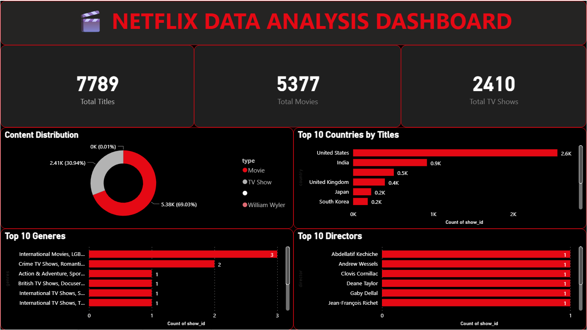
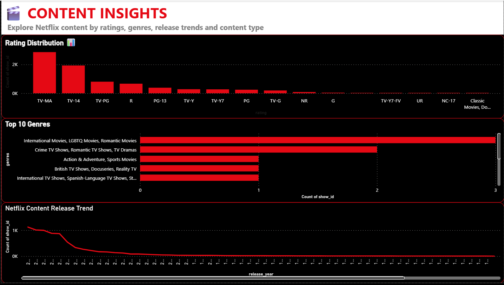
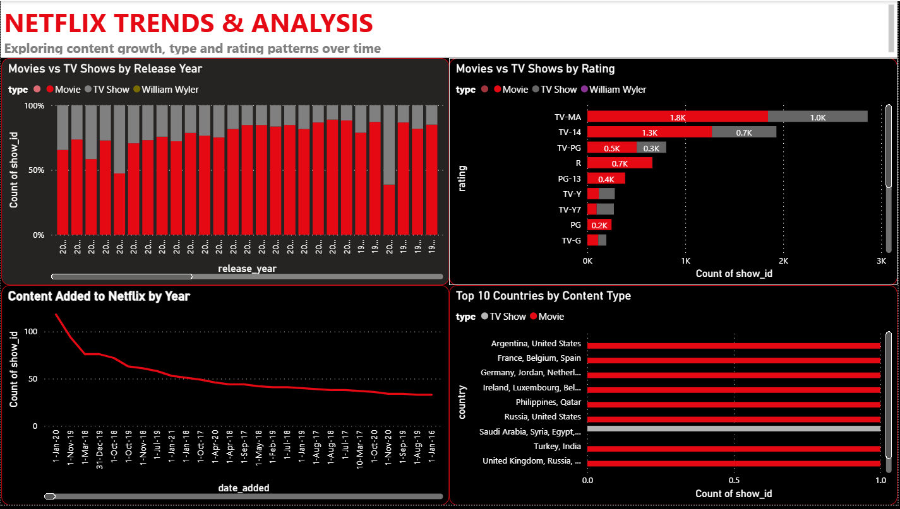

# netflix-sql-analysis
SQL analysis of the Netflix Movies and TV Shows dataset to generate business insights.

## 📌 Project Overview

This project analyzes Netflix Movies and TV Shows data using **MySQL** and presents the findings through an interactive **Power BI dashboard**.

The project demonstrates an end-to-end data analytics workflow:

**Dataset → SQL Analysis → Business Insights → Power BI Dashboard**

## 🎯 Business Questions

- How many Movies and TV Shows are present in the dataset?
- What is the distribution of Movies vs TV Shows?
- Which ratings are most common?
- Which countries have the highest number of titles?
- What are the most common genres?
- How has Netflix content changed over the years?
- Which directors have the most titles?
- How does the number of Movies and TV Shows vary by release year?

## 🛠️ Tools & Technologies

- **MySQL Workbench** — SQL analysis
- **Power BI** — Interactive dashboard and visualization
- **Microsoft Excel / CSV** — Dataset
- **GitHub** — Project documentation and version control

## 📊 SQL Analysis

The SQL analysis covers:

- Data exploration
- Content type analysis
- Rating analysis
- Genre analysis
- Country analysis
- Director analysis
- Release-year trends
- Data quality checks
- CTEs
- Window functions
- Ranking
- Year-over-year analysis

## 📈 Power BI Dashboard

The SQL analysis was used to identify important trends and insights, which were then presented through an interactive Power BI dashboard.

### Dashboard Preview

## 💡 Key Insights

## 💡 Key Insights

- **Movies account for 78.26%** of the dataset, while **TV Shows account for 21.74%**.
- **TV-MA** is the most common content rating with **7 titles**, followed by **TV-14** with **5 titles**.
- **2020** has the highest number of titles in the dataset with **3 titles**.
- **United States** has the highest number of titles with **6**, followed by **India** with **5** and **Canada** with **3**.
- Movies have an average duration of **103.83 minutes**, ranging from **47 to 168 minutes**.
- TV Shows range from **1 to 4 seasons**, with an average of **1.60 seasons**.
- The dataset contains **23 records** and includes content released between **1973 and 2020**.
- Data quality checks found **no missing titles or ratings**, while **5 records have missing director and country information**.
- No duplicate `show_id` values were identified in the dataset.

## 💡 Key Skills Demonstrated

- SQL
- MySQL Workbench
- Data Cleaning & Data Quality Analysis
- Data Exploration
- Data Aggregation & Filtering
- Conditional Logic (`CASE WHEN`)
- Common Table Expressions (CTEs)
- Window Functions (`RANK()`, `LAG()`)
- Data Analysis & Business Insights
- Power BI
- Interactive Dashboard Development
- Data Visualization
- GitHub & Project Documentation

## 👩‍💻 Author

**Yashaswini Bakshi**
